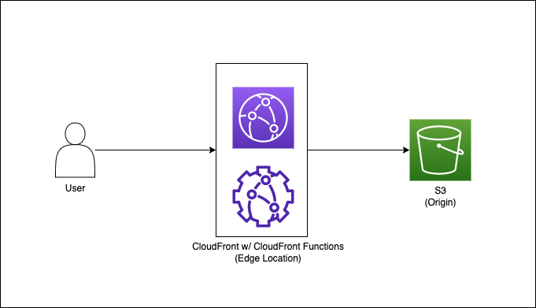

# Terraform x CloudFront Function

## Overview 

This repository stores example codes to provision a static web site by CloudFront and S3 bucket.



```bash 
terraform init 
terraform plan 
terraform apply 
```